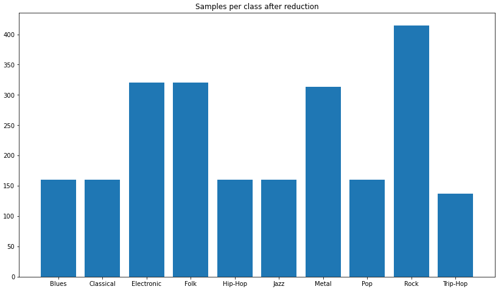

# Music Genre and Emotion Recognition
Music genre classification and emotion recognition (regression) in PyTorch, using LSTM, CNN, transfer learning and multitask learning. A project for my MSc course 'Pattern recognition'.

### Example figures

